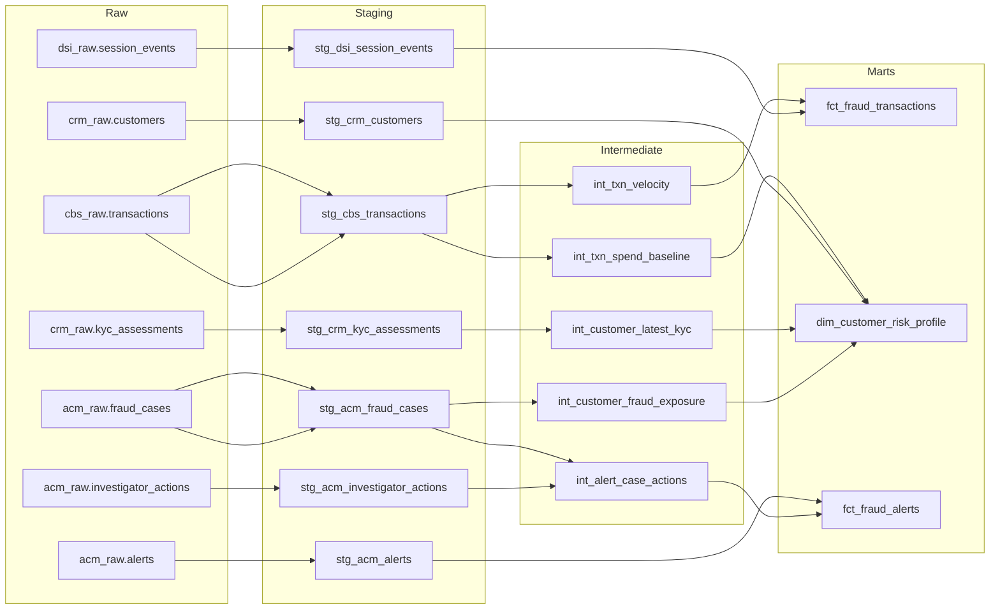

# Fraud Analytics Pipeline Design Document

## Problem Statement And Objective

This package implements the approved fraud analytics BRD as a reviewable dbt pipeline for the local Postgres prototype in this repository. The objective is to replace ad-hoc extracts with a governed transformation layer that supports transaction scoring, customer risk profiling, investigator workflows, and audit-ready lineage.

## Confirmed Context

- SQL dialect: Postgres.
- Dialect evidence: this repository exposes a local `postgres:16` stack, the source metadata remaps the original Snowflake-style namespaces into Postgres schemas, and the README states those local schemas are the identifiers to use in dbt.
- Publishing mode: static review docs.
- Reason: there is no existing Docusaurus project or package manager lockfile, and the skill preflight recommended static Pages publishing.

## Source And Target Summary

| Layer | Entities | Notes |
| --- | --- | --- |
| Raw sources | `cbs_raw.transactions`, `crm_raw.customers`, `crm_raw.kyc_assessments`, `dsi_raw.session_events`, `acm_raw.alerts`, `acm_raw.fraud_cases`, `acm_raw.investigator_actions` | Local Postgres prototype of the fraud source layer. |
| Staging | Seven `stg_*` models | Type casting, UTC conversion, key cleanup, normalization, deduplication. |
| Intermediate | Five `int_*` models | Latest KYC, fraud exposure, spend baselines, velocity, and case-action rollups. |
| Marts | `fct_fraud_transactions`, `dim_customer_risk_profile`, `fct_fraud_alerts` | Consumer-facing datasets defined in the BRD. |

## Proposed DBT Model Structure

## Transformation Flow

1. Stage every raw source into stable dbt relations with trimmed keys, parsed dates, UTC timestamps, and normalized codes.
2. Build reusable intermediate features:
   - transaction velocity windows
   - 90-day spend baseline and dominant merchant country
   - latest KYC status per customer
   - confirmed fraud exposure per account
   - latest investigator assignment per case
3. Publish three marts that match the BRD outputs and carry `pipeline_loaded_at` for auditability.

## Key Business Rules

- `fct_fraud_transactions` keeps debit, non-reversal transactions because the curated fact does not expose a debit/credit direction column and the source semantics state fraud models are primarily concerned with debit activity.
- `fct_fraud_transactions.channel_code` normalizes unexpected channel codes to `OTHER`.
- `dim_customer_risk_profile.risk_tier` follows the BRD literally: `HIGH` for PEP or any confirmed fraud history, `MEDIUM` for `PENDING` or `EXPIRED` KYC, otherwise `LOW`.
- `fct_fraud_alerts.alert_priority` follows the explicit score and rule overrides from the BRD.

## Data Quality And Testing Strategy

- Source freshness is defined in `models/sources.yml` using the raw landing timestamp columns.
- Primary keys are covered with `unique` and `not_null` tests at the source and mart layers.
- Referential integrity is enforced for:
  - `fct_fraud_transactions.account_id -> dim_customer_risk_profile.account_id`
  - `fct_fraud_alerts.transaction_id -> fct_fraud_transactions.transaction_id`
- Accepted values are applied to `channel_code`, `risk_tier`, `alert_priority`, and `disposition_code`.
- Custom singular tests cover:
  - positive transaction amount
  - `ip_risk_score` in the `0..1` range
  - `alert_score` in the `0..1` range
- Quality gap: the BRD requires a +/-5% staging row-count anomaly test against the prior run. That needs run-history state and has been documented as an operational follow-up instead of being hard-coded into this package.

## Assumptions, Risks, And Open Questions

- Assumption: the local Postgres prototype is the target review dialect for this package. If the production warehouse remains Snowflake, date arithmetic and timezone functions should be translated during production hardening.
- Assumption: the curated transaction fact excludes credit and reversal postings. This is aligned to the fraud use case but should be reconfirmed with Fraud Operations before production sign-off.
- Assumption: `dim_customer_risk_profile` excludes only closed accounts so downstream fact relationships remain intact. The BRD describes "active" accounts, but dormant-account handling is not fully resolved.
- Risk: the governed `ref.high_risk_mcc` content was not supplied. The package ships an empty seed to make the dependency explicit without inventing reference data.
- Risk: the BRD does not define a special `risk_tier` treatment for `FAILED` KYC records. The current implementation follows the documented rule and leaves `FAILED` to the fallback `LOW` branch.
- Open question: confirm whether `session_txn_ref` is populated for all digital card-not-present events, as noted in the BRD open items.

## Operational Notes

- Fact models are configured as incremental-ready relations, but the prototype currently scans the staged inputs end-to-end until a production late-arrival strategy is agreed.
- The package publishes static review docs through `.github/workflows/publish-static-docs.yml` without requiring dbt profiles, warehouse secrets, or Node dependencies.
- GitHub Pages must be enabled once under repository settings with `GitHub Actions` selected as the source.
