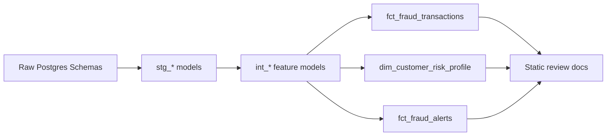
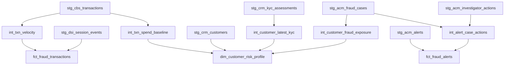

# Mermaid Diagrams

## Pipeline Flow

```mermaid
flowchart LR
  Raw[Raw Postgres Schemas] --> Staging[stg_* models]
  Staging --> Features[int_* feature models]
  Features --> Txn[fct_fraud_transactions]
  Features --> Dim[dim_customer_risk_profile]
  Features --> Alerts[fct_fraud_alerts]
  Txn --> Docs[Static review docs]
  Dim --> Docs
  Alerts --> Docs
```

## Source-To-Target Lineage

```mermaid
flowchart TD
  T[cbs_raw.transactions.txn_ref_no] --> FT1[fct_fraud_transactions.transaction_id]
  T2[cbs_raw.transactions.acct_no] --> FT2[fct_fraud_transactions.account_id]
  T2 --> DC1[dim_customer_risk_profile.account_id]
  K[crm_raw.kyc_assessments.kyc_status_cd] --> DC2[dim_customer_risk_profile.kyc_status]
  F[acm_raw.fraud_cases.disposition_cd] --> DC3[dim_customer_risk_profile.lifetime_confirmed_fraud_count]
  A[acm_raw.alerts.alert_uuid] --> FA1[fct_fraud_alerts.alert_id]
  A2[acm_raw.alerts.txn_ref_no] --> FA2[fct_fraud_alerts.transaction_id]
  I[acm_raw.investigator_actions.investigator_emp_id] --> FA3[fct_fraud_alerts.investigator_id]
  S[dsi_raw.session_events.device_fp] --> FT3[fct_fraud_transactions.device_fingerprint_hash]
```

## Model Dependency Diagram

```mermaid
graph TD
  stg_cbs_transactions --> int_txn_velocity --> fct_fraud_transactions
  stg_cbs_transactions --> int_txn_spend_baseline --> dim_customer_risk_profile
  stg_dsi_session_events --> fct_fraud_transactions
  stg_crm_customers --> dim_customer_risk_profile
  stg_crm_kyc_assessments --> int_customer_latest_kyc --> dim_customer_risk_profile
  stg_acm_fraud_cases --> int_customer_fraud_exposure --> dim_customer_risk_profile
  stg_acm_alerts --> fct_fraud_alerts
  stg_acm_fraud_cases --> int_alert_case_actions --> fct_fraud_alerts
  stg_acm_investigator_actions --> int_alert_case_actions
```
